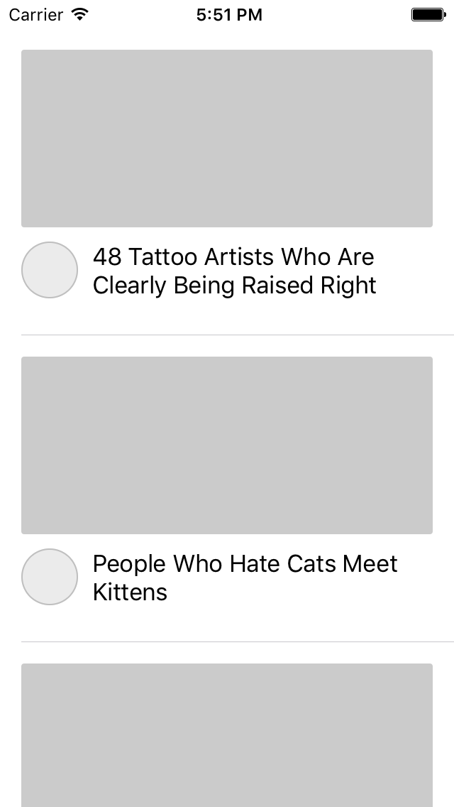
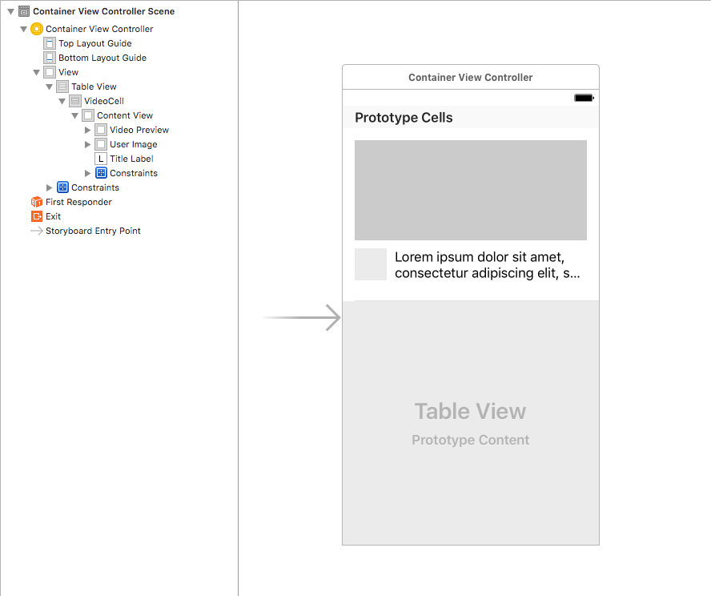

The word animation is derived from _anima_, the Latin word for soul.
Animations allow developers to breathe life into their apps by manipulating static UI elements. Common uses for animations in your iOS apps include guiding the user's attention and providing feedback as users interact with your app.

In this tutorial, you'll learn the basics of animations as you recreate Youtube's picture in picture (PIP) feature. We'll cover the following:

1. Container Views
2. `UIView` Animations
3. `UIPanGestureRecognizer`

This tutorial assumes that you already have an understanding of the following concepts:

- Setting up and using `UITableView`
- Creating `UIViewsController` with `UINib`
- Adding `NSLayoutConstraint` programmatically
- Adding `UIView` programmatically

# Getting started
[Download the starter project](https://github.com/ocwang/ios-pip-example) and run it on the simulator. You should see a `UITableView` loaded with fake data like so:

# Lay of the land

Before we dive into go, let's take a quick look at what's already included in the project.

## Storyboard

Navigate to your _Main_ storyboard file. You should see a single `UIViewController` that is your initial view controller. For this project, we won't be adding or changing anything in our storyboard.

## Child View Controllers

In your Project Navigator, expand the _VideoViewController_ directory. There are two `UIViewController` files. `VideoViewController` and `DetailViewController` represent the video player and comments components when you view a video in the Youtube app.

> [info]
> You might be wondering why the video player and comments aren't both part of a single view controller. You'll learn why each component exists as a separate view controller as we learn about container views in the next section.

## Extensions and Utility Helper

Expand the `Utilities` and `Extensions` directories. You'll notice a couple extensions files and helper objects that make development easier:

- `UIColorExtensions.swift` provides easy access to common colors used throughout the project
- `NSObjectExtensions.swift` allows us to abstract repetitive boilerplate code associated with using `UINib` files.
- `Utility.swift` provides helper methods to calculate the height or width of the video player as it scales in the PIP feature.
